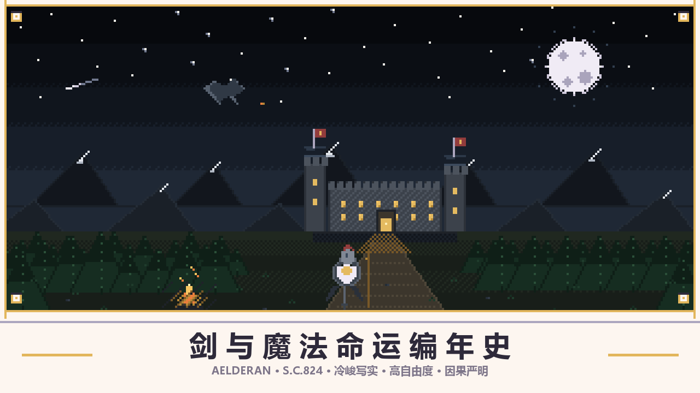

# 剑与魔法命运编年史 · 网页版

> 依据《剑与魔法命运编年史》完整设定集 v1.0（卷一至卷二十七）实现的 **单文件网页文字 RPG**。
> 世界基调照文档执行：**冷峻写实 · 高自由度 · 因果严明**。

**在线游玩地址（GitHub Pages）：<https://subang08.github.io/jymf-chronicle/>**

打开就能玩，不用装任何东西。手机上也能开。

---

## 一、这是什么

一个跑在浏览器里的单人文字冒险：种族 / 职业 / 身份 / 背景 / 天赋抽选建卡，
46 处地区与多层地图、任务生成、疲劳饥渴负重声望、战斗与生死豁免，全部按设定集实现；
叙述遵守交付要求的强制写作约束（禁用 AI 模板腔、反应优先级、不许工具人行为）。

**它有一个联网层**：可以把「对话、事件、每回合的四个选项、自定义行动」交给 AI 写，
而骰子、数值、判定、物品、战斗**始终在本地算**。AI 是可选增强，不接也能完整玩。

| 玩法 | 怎么进 | 叙述从哪来 | 需要什么 |
|---|---|---|---|
| 在线版 | 上面的 Pages 网址 | 引擎内置模板；也可在页面里接 AI | 一个现代浏览器 |
| 离线单文件版 | 下载 `剑与魔法命运编年史.html` 双击 | 同上 | 什么都不用 |
| 只在 DeepSeek 聊天里玩 | 把 `docs/DeepSeek开玩包.md` 的整块正文粘进对话 | 模型自己写 | 一个 DeepSeek 账号 |
| 自建联网版 | 双击 `启动联网版.bat`（需 Node 18+） | 同上，另可把 Key 留在服务端 | Node（可选） |

---

## 二、AI 接入（三步，不需要任何服务器）

DeepSeek 官方接口**允许浏览器直连**（预检允许 `authorization,content-type`，并回显任意 Origin），
所以官方后台可以直接用，中间不需要任何程序：

1. 打开网页，点 **「AI 接入」**（起始页首屏 / 顶栏最右 / 底部按钮排 / 设置弹层，四处都能进）。
2. 点一下 **「DeepSeek 官方」** 预设（端点与模型自动填成 `api.deepseek.com/v1` + `deepseek-chat`）。
3. 把 `sk-` 开头的 Key 粘进 **API Key** → **保存并测试** → 看到「好了：直连 … 可用」→ 关掉弹层，点一下底部 **AI 开关**。

**每台设备各配各的**：配置存在那台设备的浏览器里，互不影响，**没有总服务器，也不用联机**。
不想用官方，也可以直连自己设备上的模型（预设里都有）：

| 你在哪台设备上跑模型 | 端点数填 |
|---|---|
| 本机 Ollama（`ollama serve` → `ollama pull deepseek-r1:7b`） | `127.0.0.1:11434/v1` |
| 本机 LM Studio（打开「本地服务器」） | `127.0.0.1:1234/v1` |
| 另一台设备的 Ollama（那台开 `OLLAMA_HOST=0.0.0.0` 与 `OLLAMA_ORIGINS=*`） | `192.168.x.x:11434/v1` |

端点可以只写域名或 IP：本机与内网自动补 `http`，公网域名自动补 `https`。
点「保存并测试」的结果**写在弹层里的「测试结果」那一行**，没通会跟一句该怎么做。

### 接了 AI 之后，谁管什么

| 内容 | AI 负责 | 引擎仍负责 |
|---|---|---|
| 叙述 / 对话 | 每一段的文字（流式逐句落进原文字块） | 判定成败、伤害、状态 |
| 每回合四个选项（a–d） | 四个槽位（顺势 / 走险 / 细看 / 收手）的具体文字与动作 | `act` 白名单与槽位相称性；认不出就**退回引擎原话**，不会出现点不动的按钮。战斗 / 濒死 / 开篇剧本的选项不由 AI 写 |
| 事件触发 | 「出的是什么事」 | 触发概率与量级（热度 / 威胁 / 地形）、敌人白名单、伤害骰、掉落 |
| 自定义行动 | 把一句话读成结构化意图 + 那一段叙述 | 校验意图（东西在身上、怪在图鉴里、地方真的相邻），判定用本地骰子、DC 钳 8–16 |

**接不上也不影响玩**：模型超时、报错、没配 Key，全都自动落回引擎自己的叙述与选项，回合照常走完。

---

## 三、写作约束（接 AI 时强制生效）

无论是哪条通道，提示词里都带着交付要求的那份强制约束，服务端另有第二道闸（流式按句拦截，命中就替换）：

- **写作前自检**：先推演角色此刻的动机、处境、性格底色，再落笔；
- 动作、对话、心理必须贴人物当下处境，**禁止为推进剧情捏造行为**，**拒绝工具人**；
- **禁止上帝视角灌输内心**，用动作、神态、对话体现；
- **明令禁止**「不是……而是……」「从来不是……而是……」「不仅仅是……更是……」这类二元对立模板句；
- **禁止滥用**：微不可查 / 不易察觉 / 不由得 / 不禁 / 随即 / 片刻后 / 只见 / 就在这时 / 深刻地 / 无比 / 极其 / 格外 / 至关 / 关键性 / 错综复杂 / 交织 / 谱写 / 画卷 / 织锦 / 镌刻 / 烙印；
- **行文硬规则**：不搞哲理升华、不写三段排比、对话简短贴身份、**反应优先级＝环境刺激 → 身体本能 → 语言**、不凭空捏造设定；
- 每写一小段过四问自检（动机成立吗 / 删掉禁词逻辑还成立吗 / 有没有强行对比 / 是不是只为赶路）；
- 提示词里还附了**反面示例**（靠副词凑氛围、用「不是…而是…」造深度、无信息量对答、总结句盖章），写成那样即不合格。

---

## 四、怎么玩（要点）

1. **建卡**：种族 → 职业 → 身份 → 背景 → 天赋 → 性别 → 姓名 → 属性 → 阵营 → 国度 → 层 → 地区 → 开篇 → 确认。
   选项按设定集实际数量从 `a` 顺排（18 个种族就是 a–r）。**进入游戏前只有选项，没有自定义**。
2. **天赋是抽的**：`50%` 五个 D 级 / `30%` 四个 C 级 / `15%` 三个 B 级 / `4%` 两个 A 级 / `1%` 一个 SSS 级，
   抽到多少就带走多少，最多抽五次、最后收下其中一组。
   （彩蛋：在这一步的对话框里输入 **剑与魔法**，可解锁自由选择，上限四项。）
3. **游戏进行时选项固定 a–e**：`a 顺势而为`、`b 剑走偏锋`、`c 谨慎观察`、`d` 稳妥一条路、`e 自定义行动`。
4. **底部按钮**：查看玩家状态 / 查看物品栏 / 地图 / 前往近处 / 长途出行 / 查看任务 / 战斗面板 / 星母历 / **刷新** / 典籍 / AI 事件 / **AI 接入** / **AI 设置**。
   - **刷新**：只重画当前数据（边栏、按钮排、时间行）并做数据自检，**不追加不改写已生成的内容、不动未选选项、不消耗回合**。
   - **地图**：四层钻取（大陆总图 → 国度疆域 → 地区 → 地标），滚轮缩放、拖拽平移、复位。
   - **前往近处 / 长途出行**：前者只列相邻一站，后者列多站行程并给四档走法（天数 / 盘缠 / 疲劳 / 风险）。
5. **文字区只增不减**：说了什么、算出了什么，都留在上面可以上划回看；左侧节点可回看每一回合（纯回顾，不改进度）。

---

## 五、仓库结构

```
index.html                  ← 在线版入口（与下面那份成品完全相同）
剑与魔法命运编年史.html       ← 单文件成品：下载后双击即玩
build.py                    ← 打包器：把 build/ 拼成上面那份 HTML，并做硬约束校验
build/                      ← 源码模块（12 个）
  latex.js    面板渲染器（LaTeX 子集 → 莫兰迪面板）
  world.js    设定集静态数据（神明 / 国度 / 地区 / 种族 / 职业 / 怪物 / 道具 / 神器 / 历法 / 语言…）
  geo.js      地理情报：坐标、方位、邻地、国家内部分层、地区志 / 国度志 / 疆域志
  map.js      四层地图（SVG + 钻取 + 缩放平移）
  tables.js   随机表（地形 d20 / 城市 d12 / 夜间 d10 / 任务四表 / 十二月天气）
  narr.js     离线叙述引擎（110 条场景模板、160 条对白、4 个开篇共 20 节剧本）
  engine.js   规则引擎（骰子 / 检定 / 战斗 / 历法 / 疲劳 / 饥渴 / 负重 / 声望 / 经济 / 工艺 / 任务 / 天赋）
  panels.js   18 类面板生成器
  improv.js   生成器（种族 / 职业 / 身份 / 背景 / 天赋 / 国度 / 物品）
  create.js   建卡流程
  game.js     控制器（回合循环 / 只增不减文字区 / 节点 / 侧栏 / 存档 / 刷新 / AI 选项与事件）
  net.js      联网层（双通道、AI 设置、流式补叙、禁用词闸门、选项与事件契约）
docs/                       ← 原设定集（卷一至卷二十七）、DeepSeek 开玩包（md + txt）、接口规范（SPEC.md）
tools/make-deepseek-pack.js  ← 由原设定集重新生成开玩包（node tools/make-deepseek-pack.js）
server/                     ← 可选的本机小桥：Node 零依赖，藏 Key / 绕开 CORS / 托管网页
tests/                      ← 自动化测试（见下）
启动联网版.bat               ← 双击启动本机小桥（可选；平时直接开 HTML 即可）
```

重新打包：`python build.py`（会打印模块体积；出现禁用词、emoji、外链、`Math.random`、缺失占位时**拒绝出包**）。

---

## 六、测试

无头套件与浏览器套件都在 `tests/`。默认指向本仓库根目录，也可以用环境变量指到你的副本：

```powershell
$env:JYMF_ROOT="C:\path\to\剑与魔法命运编年史-网页版"
node tests/headless.js      # 16 套 975 项：建卡 / 回合 / 只增不减 / 侧栏 / 规则引擎 / 面板 / 设定集覆盖 /
                            #   成品审核 / 地理 / 地图 / 出行 / 建卡无自定义与天赋抽选 / AI 选项合并 / 刷新
node tests/audit.js         # 目标条款核验 72 项
node tests/servertest.js    # 小桥服务器 62 项（含强制写作约束是否随请求发出、两端是否一致）
```

浏览器套件需要 Edge（`real.js` / `aibrowser.js` / `aidirect.js` / `aisetting.js` / `aigen.js` / `refreshcheck.js`），
它们用 CDP 真点鼠标、真敲键盘，覆盖离线玩法、小桥模式、直连模式、AI 设置交互、AI 生成选项与事件、刷新行为。

---


---

## 七、只用 DeepSeek 聊天窗口玩（不用网页）

不想开网页、只想在聊天窗口里玩？`docs/` 里已经备好了**整块可复制**的开玩包：

| 文件 | 用途 |
|---|---|
| `docs/DeepSeek开玩包.md` | 三步说明 + 精简版（约一千字）+ **【开玩包】整块正文**（设定集全文 + 写作约束 + 主持规则 + 开场指令） |
| `docs/DeepSeek开玩包.txt` | 同上，纯文本、不带任何 Markdown 记号，方便直接复制 |
| `docs/原设定集.md` | 设定集原文（卷一至卷二十七），供阅读与查阅 |

用法：打开 **chat.deepseek.com** → 新建对话 → 把【开玩包】那一整块粘成第一条消息 → 它就会从选开篇、建卡开始，一轮一轮给你 a-e 选项。
嫌两万四千字太长，就先用包里的**精简版**（约一千字，规则齐全、细节少）。

开玩包里写的规则与网页版一致：建卡七步、选项一个个来、五个固定选项（a 顺势 / b 走险 / c 细看 / d 稳妥 / e 自定义）、
每轮末尾状态栏、d20 判定与具体后果、以及那份**剧情写作强制约束**（含自检四问与反面示例）。
区别只在于：聊天窗口里没人替模型算数，数值它自己说了算；网页版有引擎兜底。

---

---

## 九、像素画



*月之女士的银月、龙骨山脉的雪线、飞过的巨龙、点亮窗火的城堡、通往城门的路上站着一名持盾骑士——画面里的每一样东西都对应设定集里的一卷。*

| 文件 | 说明 |
|---|---|
| `docs/images/pixel-cover.png` | 主视觉：320x180 逻辑像素 ×4 = 1280x720，中世纪像素风夜景 |
| `docs/images/pixel-icons.png` | 道具图标 8 枚（16x16 ×6）：d20、剑与盾、药水、卷轴、火把、旗帜、龙首、骷髅 |
| `tools/make-pixel-art.py` | 生成脚本：**零依赖**（PNG 用标准库 zlib 写；有 Pillow 时额外排标题字），`python tools/make-pixel-art.py` 重新出图 |

调色板沿用游戏的美术方向：冷石板夜空 + 奶白莫兰迪画框，加中世纪的金、血红、松绿与炉火橙；画框与金线对应面板规范里的莫兰迪面板。

---

## 十、说明

- 纯单文件、零外部依赖、零 CDN；不含图片素材，界面刻意不用 emoji。
- 尚未实现多人或联机：设定就是**单人、可离线**，AI 只是把叙述交给模型写。
- 本仓库内容依据用户提供的设定集与写作约束实现，仅供个人游玩与研究。
